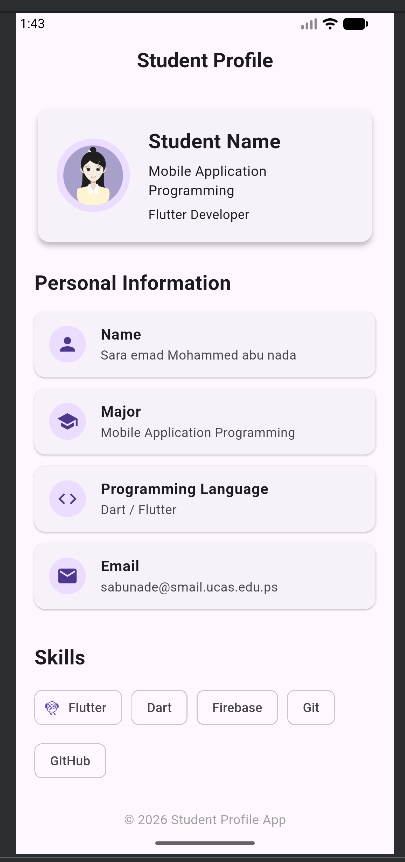

# GitHub Training Project

## Student Profile App

A simple mobile application developed using Flutter and Dart.

The project was created as part of a Git and GitHub training assignment.
It demonstrates basic Git commands, GitHub collaboration, branches, issues,
pull requests, and Flutter application development.

## Project Description

github-training-project is a simple Flutter mobile application that displays
student information in a clean and organized interface.

The application contains:

- AppBar
- Student profile card
- Personal information cards
- Programming skills
- Footer
- Responsive layout

## Technologies Used

- Flutter
- Dart
- Git
- GitHub
- Material Design

## Project Structure

lib/
|- main.dart
|- home_screen.dart
|- widgets/
    |- student_card.dart
    |- info_card.dart

## Features

- Simple and clean user interface
- Student profile information
- Skills section
- Reusable Flutter widgets
- Responsive layout
- Organized project structure

 ## How to Run

1. Install Flutter.
2. Clone the repository.
3. Open the project directory.
    cd github-training-project
4. Install dependencies.
     flutter pub get
5. Run the application.
     flutter run

## Git Commands Used

git init
git add .
git commit -m "Initial project setup"
git checkout -b feature/design-update
git add .
git commit -m "Updated design"
git checkout main
git merge feature/design-update
git push

## Screenshots

### Home Screen

## Student

Sara emad abu nada

## License

This project was created for educational purposes.
